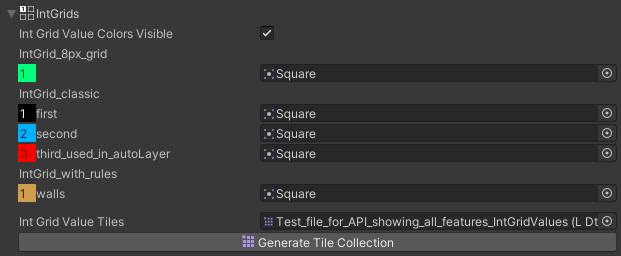

# IntGrid Value Section

The sprites assigned to IntGrid values determine the collision shape of them in the built tilemap, based on a sprite's physics shape.
Leave any fields empty for no collision.

If a field is left empty, there will be no collision for that IntGrid value.

At the bottom, there is a button to generate a tile collection for all int grid tiles based on the fields assigned here. Upon pressing the button, the field will automatically be assigned with the newly generated Tile Collection asset.

