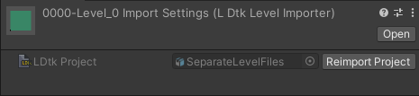

# Level Importer

In addition to the imported project, separate level files can also be imported.  

The file format for imported separate level files is `.ldtkl`.  
To enable separate level files, toggle on the checkbox in LDtk's project settings.  
  

There are many benefits to using separate level files:
- Helps enable modular level design. (ex. randomly-generated dungeon with levels for dungeon pieces)
- Only modified level files will reimport instead of the project and all levels, resulting in quicker import speeds when applicable
- Only the dependencies involved in a particular level will reimport the level instead of involving all possible dependencies (Entities, IntGrid tiles)
- Only the level assets in the scene are loaded into memory during runtime.  
- Level files can be imported simultaneously in parallel, resulting in faster import times when reimporting multiple levels. Available in Unity 2021.2 or higher at `Project Settings > Editor > Asset Pipeline > Parallel Import`

For speed reasons, using separate level files is preferable, especially for any larger scale game projects.

## Inspector
The importer inspector displays a reference to the level's project which can be clicked to locate the project in the hierarchy window.  
The project can also be re-imported from here with a quick button.  

### Depend On Dependencies
Used by both project and level. [See here.](topic_Section_Dependencies.md#depend-on-dependencies)

## Nested Prefabs
Imported LDtk levels can be nested in prefabs.  

