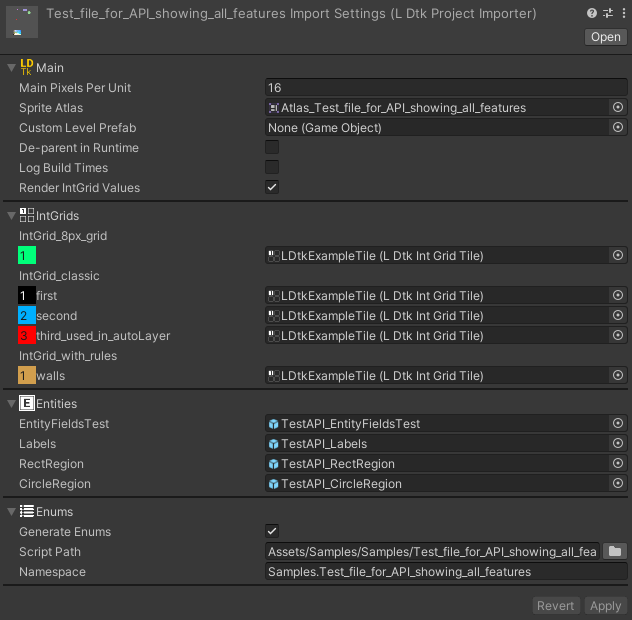
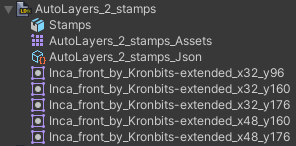

# Project Importer

Store the LDtk project file in the Unity project so that it can be imported.

The file format must be `.ldtk`.  
  

**Simply drag-and-drop this main asset into the scene.**  
  

## Inspector
The importer inspector is composed of several sections:   
[**Main**](topic_Section_Main.md), 
[**IntGrids**](topic_Section_IntGrids.md), 
[**Entities**](topic_Section_Entities.md), 
and [**Enums**](topic_Section_Enums.md).

- After making any changes, click the apply button at the bottom to reimport.
- If any section is hidden, it's because there were no associated definitions in the LDtk project.

## Hierarchy
The imported project generates a hierarchy of GameObjects:  
- Project Root
  - Worlds
      - Levels
          - Layers
              - Entity/Tilemap GameObjects
    

## Sub-Assets
In addition to the generated GameObjects, some other sub-assets are also generated:
- [**Artifact Asset**](../Topics/topic_ArtifactAssets.md)
- [**Json Project**](../Topics/topic_ProjectFile.md)
- Sprites
  - The sprites are used in Auto-Layers, Tile-Layers, and Tile fields.  
  Referencing these sprite assets for any purpose outside of what's managed by the importer can be risky, as they could go missing if the tile is no longer used in the LDtk project. 
    

## Tilesets
All tileset sprites will be automatically generated.  
However, Aseprite files are currently not supported and will arrive in a future update.