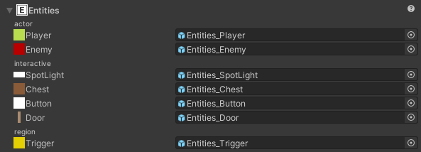

# Entities Section

Assign GameObjects that would be spawned as entities.  

If a field is left empty, then an empty gameObject will exist in it's place.

### Position
The prefab instance's transform position is set as the exact position in LDtk.  
Ensure the root prefab's pivot point is similar to the entity's pivot defined in LDtk.

### Scale
The prefab instance's transform scale adjusts accordingly if the entity instance was resized in LDtk.  
The scale value is determined by the difference between the original entity size and the resized entity in LDtk.  
So when making the prefab for an entity instance, make the prefab match the exact same scale size as the entity's definition in LDtk, and not the resized entity instance.  

Example: In LDtk, an entity's definition size is 16x16 pixels and the prefab's root scale is (1, 2, 3). 
If an entity instance is resized to 32x48 pixels in the level, then the scale multiplier would be (2, 3, 1), and thus, the resultant scale of the entity instance in Unity would be (2, 6, 3)

### Scene Drawing
The entities draw many of what is drawn from LDtk, like icons and fields.  
These can be customized in the [**Preferences**](../Topics/topic_Preferences.md).

## Fields
The instantiated entity prefab will have a [**Fields**](../Topics/topic_Fields.md) component added for getting the level's fields.  
Instantiated entity prefabs can execute custom events upon import with the [**import interfaces**](../Topics/topic_CustomImporting.md).