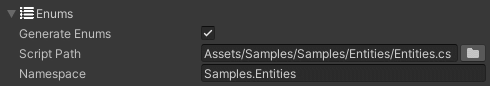

# Enums Section

LDtk enums can be automatically generated as scripts.  

If enabled, a single C# script will be generated upon import.
- The script contains all the enums of the LDtk project.
- The script will be generated at a specified path. Use the folder button to browse a desired location.
- A namespace field is available to specify the namespace for the generated script (Leave empty for no namespace).

**Note:**
- Be aware that overwriting enums may break your current codebase if:
  - A namespace was changed
  - The enum definition name/values are changed
  - The enum file was generated in a different path resulting in two of the same script existing
- If the enum file gets lost, you can regenerate the script by reimporting.