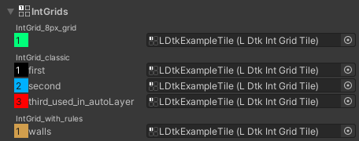

# IntGrids Section

Assign [**IntGrid Tiles**](../Topics/topic_IntGridTile.md) for collision.    
Create a new Int Grid Tile with the button at the top-right region of the inspector. 

- All of the IntGrid layers and their values are displayed here for assigning.
  - The IntGrid Tiles are intended for collision first and foremost.  
    However there are also options for simple rendering, or GameObjects in tile-space.

- If a field is left empty, then a default tile would be used.
  - This tile is a square with no collision.

- Choose whether to render IntGrid Tiles in the [**Main Section**](topic_Section_Main.md).