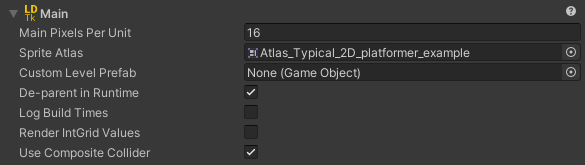

# Main Section

The root area has some general settings.  

### Pixels Per Unit
Tile assets pixels per unit.
This number dictates what all of the instantiated tilesets/entities will change their scale to, measured in pixels per unity unit.

**Note:** Upon first time importing the LDtk project or when the importer is reset, this value will default to the `DefaultGridSize` defined in LDtk.

### Sprite Atlas
Create your own [**Sprite Atlas**](https://docs.unity3d.com/Manual/class-SpriteAtlas.html) and assign it here.  
You can also create one with the button in this field.  
  
All tiles that are used in levels will be packed to the Sprite Atlas.

- This solves [**tilemap tearing**](../Topics/topic_TilemapTearing.md). 
- The managed sprite atlas is reserved for auto-generated sprites only.
  - Any foreign sprites assigned to the atlas will be removed. **It does not need to be manually managed**, as all sprite contents assigned to the atlas will be overwritten with every import.
- Only the individual tiles that are used are packed, resulting in optimal atlas size.
- This field will only appear if any tilesets are defined in the LDtk project.

### Custom Level Prefab
Optional. This prefab is instantiated as the root GameObject for all levels in the build process.  
Whether the field is assigned or not, the instantiated GameObject will have a [**Fields**](../Topics/topic_Fields.md) component added for getting the level's fields.  
Use this prefab field as a primary means of executing custom events upon import with the [**import interfaces**](../Topics/topic_CustomImporting.md).

### De-parent In Runtime
If this is set on, then the project, levels, and entity-layer GameObjects will have components that act to de-parent all of their children on start.  
This results in increased runtime performance by minimizing the hierarchy depth.  
Keep this on if the exact level/layer hierarchy structure is not a concern in runtime.  
[**Article about this particular optimization**](https://blogs.unity3d.com/2017/06/29/best-practices-from-the-spotlight-team-optimizing-the-hierarchy/)  
While this may not be a feature that is contextual to LDtk, it's a nice-to-have.  

### Render IntGrid Values
When this is enabled, all [**IntGrid Tiles**](../Topics/topic_IntGridTile.md) will have their tile's sprite rendered.
This toggle will only appear if any IntGrid layers are defined.  
Typically, this is not used, and only needed if rendering sprites is a goal, or for debugging.

### Use Composite Collider
Use this to add a CompositeCollider2D to all IntGrid tilemaps.   
This can help with slowdown due to very large levels and also assign with smoother collisions.

### Create Background Color
Creates a flat background for each level, based on the level's background color.
This is built to match exactly how the levels look in LDtk, however this will be off in most situations.
This only affects the background color, and not the background image, if one was configured for a level in LDtk.

### Create Level Trigger
Creates a PolygonCollider2D trigger that spans the level's area for each level. Useful in conjunction with Cinemachine for example.