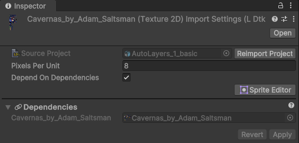
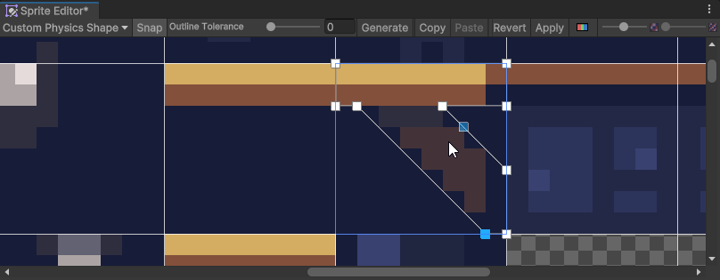

# Tileset Importer

The importer creates tileset files, which generate the sprites and tiles.
- The file format for tileset files is `.ldtkt`.  
- The files are required to use the importer, and are not generated initially.
- Only modified tileset files will reimport, resulting in less unnecessary imports when applicable. Generating sprites and tiles are a marginal portion of the heavy work.
- Tileset files can be added to a SpriteAtlas asset, and will pack all the sub-sprites generated.
- Tiles have their CustomData and EnumTags available inside them

## Inspector
The importer inspector displays a reference to the level's project which can be clicked to locate the project in the hierarchy window.  
The project can also be re-imported from here with a quick button.  

### Pixels Per Unit
Tile assets pixels per unit. This should always match with the project's Pixels per unit.

### Depend On Dependencies
Used by all LDtk assets. [See here.](topic_Section_Dependencies.md#depend-on-dependencies)

## Sprite Editor
This importer interacts with the sprite editor window similar to a Texture Importer.  
Select a Tileset file and open the sprite editor window.

You can define physics shapes which will reflect in the tilemap colliders.
  
If you are unfamiliar with the sprite editor window, you can explore more of it's use [**here**](https://docs.unity3d.com/Manual/SpriteEditor.html).  

Tile/Auto layers will include these tiles, and have the corresponding collision, if defined.

#### Note 
- Unlike the TextureImporter, this sprite editor will always have a fixed amount of rectangles and their rectangle\names will revert back upon applying changes.  
Everything else is adjustable. This includes:
  - Secondary Textures
  - Physics Shape
  -  Pivot
  - Border
- The imported tilemaps with these collisions shapes currently have no options for assigning tag/layer/physics material, and so will require postprocessing to have finer control. However, options may come later.