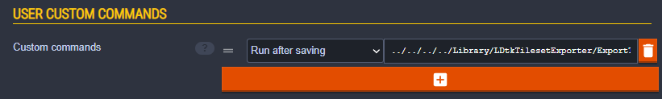
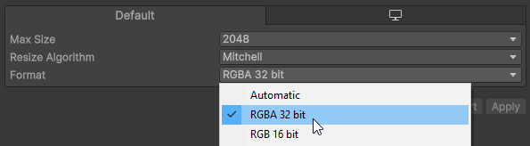

# Startup Guide
This will be a step-by-step guide for how to use the Unity importer for LDtk.  
The importer is structured where it separates the handling of tileset definitions into separate **[Tileset Files](../Importer/topic_TilesetImporter.md)**.  
For that reason, this initial setup process is required so that tileset files are automatically generated after saving in LDtk.

This guide entails three major steps:
- Adding a LDtk project to the unity project
- Installing an exporter app into the Library folder
- Configuring the LDtk project to run a custom command on the exporter app

### 1. Add to the Project
Store the LDtk project file in the Unity project so that it can be imported.
- The file format must be `.ldtk`.  
  
- If the LDtk project was outside the unity project originally,
  make sure that all images are also transferred, and maintain their relativity with the LDtk project.
  LDtk files require a direct relative connection to the image files.
- You can test if the images were successfully moved by opening the LDtk project and seeing if the images were loaded successfully in LDtk.

### 2. Install the Export App
The export app will generate tileset files.
- Select the LDtk project in Unity to show the importer inspector.
- You will notice an error displayed at the top instructing to install the export app.  
  
- Click the Install button.
- After clicking, a new app is added to the Unity project's Library folder.
    - The code of the app available here:  
      **[LDtkTilesetExporter on GitHub](https://github.com/Cammin/LDtkTilesetExporter)**

### 3. Add a Custom Command
Now that the app is installed, LDtk can execute a command to run this app. But we still need to add the command to LDtk.
- Again, select the LDtk project in Unity to show the importer inspector.
- You will notice an error displayed at the top instructing to configure the project with a custom command.  
  
- From here, there are two ways to add the command to the project: automatically, or manually.
    - **Automatic:**   
      Click the "Fix" button.  
      A new dialogue will appear.  
      Ensure all LDtk apps are closed, and click the "Auto-add command" button.  
      A new dialogue will appear, asking to open the project and save.  
      Open & save your LDtk project, and you're ready!
    - **Manual:**   
      Click the "Copy" button. This copies the command to the clipboard.  
      Open the LDtk project, and open the project settings. From there, find the "Custom Commands" area.  
      Once there, create a new command, paste the command in the field, and change the timing to "Run after saving".  
      Save your LDtk project, and you're ready!  
      
    - When saving with a custom command for the first time, LDtk will display a disclaimer. Select "I understand the risks, allow commands".
        - If you're in doubt, the code of the app is available **[here](https://github.com/Cammin/LDtkTilesetExporter)**.

### 4. Texture Change
By default, Unity will configure textures with a compression of "Automatic".  
But for the importer, it will require a format of RGBA32.  
Make sure that all textures used by the importer is configured with RGBA32, or else the Tileset definition will not import properly.  

After the Tileset definitions are now ready, drag the project from the project window into the scene or the hierarchy.  
  

# Collision
There are two options to configure collision for the importer.

#### Tileset Files
You can configure the physics shape of every individual Tileset tile.  
View more information [**here**](../Importer/topic_TilesetImporter.md#sprite-editor)  

#### IntGrid Files
You can create and add IntGrid Tiles into the importer and configure a collision shape for every IntGrid value, among other things.
View more information [**here**](../Topics/topic_IntGridTile.md#collider-type)  