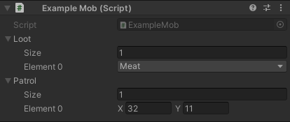

# Entities Section

Assign GameObjects that would be spawned as entities.

### Position
The prefab instance's transform position is set as the exact position in LDtk.  
Ensure the root prefab's pivot point is similar to the entity's pivot defined in LDtk.

### Scale
The prefab instance's transform scale adjusts accordingly if the entity instance was resized in LDtk.  
The scale value is determined by the difference between the original entity size and the resized entity in LDtk.  
So when making the prefab for an entity instance, make the prefab match the exact same scale size as the entity's definition in LDtk, and not the resized entity instance.  

Example: In LDtk, an entity's definition size is 16x16 pixels and the prefab's root scale is (1, 2, 3). 
If an entity instance is resized to 32x48 pixels in the level, then the scale multiplier would be (2, 3, 1), and thus, the resultant scale of the entity instance in Unity would be (2, 6, 3)

## Entity Field Injection

Entity Instances can have fields in the LDtk editor.  

These fields can be applied to the fields in scripts of instantiated GameObjects that use a [`LDtkField`](../WorkingWithAPI/LDtkField.md) attribute.  

#### View more about injecting values at [`LDtkField`](../WorkingWithAPI/LDtkField.md)

