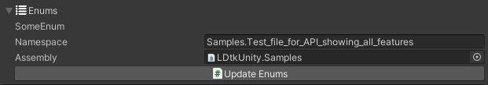

The enums would be automatically generated as scripts.

If the project contains enum definitions, an auto-generate button will be available which generates a sibling folder containing a single C# script with all the enums of the project.  
If new LDtk enums are added or change over time, hit the button to update the enums.  
Be aware however, that updating may break your current codebase if an assembly/namespace was changed, or if the enum definition name/values are changed.

