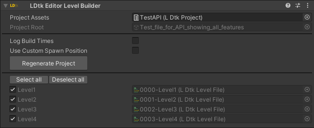

# Level Builder

This component is used to build LDtk levels.  

A level gets built by supplying the [project asset](../ProjectAsset/Main.md).  
Once the project asset is set up, several levels can be built.

### Log Build Times
Use this to display the count of levels built, and how long it took to generate them.

### Use Custom Spawn Position
Use this if spawning all levels at a custom position is desired.  
This is mostly useful in a scenario where only one level is built, and the level in LDtk is very far away from origin, which would potentially fix some position complications.

### Build Button
Press this to build all specified levels. This is the main build button.

### Level Selection
In this area, select which levels to build. You can also Select/Deselect all levels. Typically, only one, or all levels are built, but choose which ones to build as desired.

### EditorOnly Notification
If this GameObject is not tagged as EditorOnly, then a notification will appear instructing to do so.   
This is to minimise the size of the build by not including this GameObject in builds, since this eliminates the LDtk Project reference in the scene.