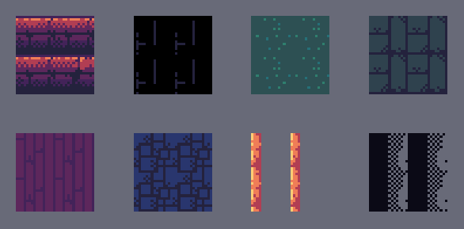

# Animated Tiles
Though LDtk does not support animated tiles, the importer has some support for it through the use of tileset tile `customData`.  

## Setup
- To animate a tile, navigate to LDtk's Tilesets section.  
- Click on a tile and a text dialogue will appear, where you can add text.  
- Then you can put information in to tell the importer how the tile should animate.  
- You type in a keyword, followed by one or more values separated by commas.  
- There should only be one keyword per line.  
  

| Keyword                | Type    | Default | Description                                                                                                                                                   | Example                                                  |
|------------------------|---------|---------|---------------------------------------------------------------------------------------------------------------------------------------------------------------|----------------------------------------------------------|
| `animatedSprites`      | `int`   | (empty) | The tile ID frames to use in the animation.                                                                                                                   | `animatedSprites 0,1,2,3,3,3,2,1`                        |
| `animationSpeed`       | `float` | 1       | The animation speed. Put one number for a fixed value. Put two numbers for a random range.                                                            | `animationSpeed 2` `animationSpeed 1.5, 3`           |
| `animationStartTime`   | `float` | 0       | The initial animation time of a tile. Put one number for a fixed value. Put two numbers for a random range.                                           | `animationStartTime 0.5` `animationStartTime 0, 2.5` |
| `animationStartFrame`  | `int`   | 0       | The initial animation frame of a tile. Put one number for a fixed value. Put two numbers for a random range. This overrides `animationStartTime`. | `animationStartFrame 2` `animationStartFrame 0, 3`   |

- All keywords are optional. If one is left unused, the value will be it's default displayed in the table below.and have a default value if unused, but `animatedSprites` is required to do any animation.  
- The naming convention is based on Unity's [TileAnimationData](https://docs.unity3d.com/ScriptReference/Tilemaps.TileAnimationData.html) and [AnimatedTile](https://docs.unity3d.com/Packages/com.unity.2d.tilemap.extras@4.0/manual/AnimatedTile.html).

## Disclaimer
- You can only use other tiles within the scope of the same tileset. No external sprites may be used.
- All aspects of animation randomness are determined in runtime and not during the import process, so every start will be different.
