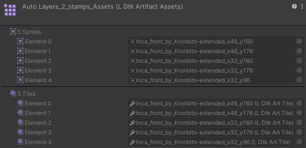

# Artifact Assets
[_**Scripting Reference**_](../../api/LDtkUnity.LDtkArtifactAssets.yml)  

This is an import product of the [**Project Importer**](../Importer/topic_ProjectImporter.md).  
It stores references to level backgrounds.
  

# Artifact Assets Tileset
[_**Scripting Reference**_](../../api/LDtkUnity.LDtkArtifactAssetsTileset.yml)

This is an import product of the [**Tileset Importer**](../Importer/topic_ProjectImporter.md).  
It stores references to sprites and tiles for AutoLayers or Tile layers.  