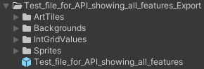
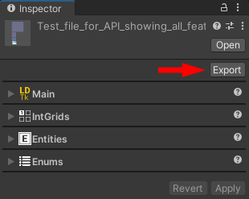
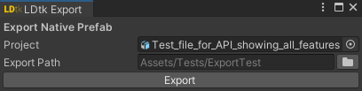

# Export Native Prefab

It is possible to export a prefab, independent of an imported LDtk project.  
  

This prefab uses assets and components that are entirely native to unity, so it could function properly even if LDtkToUnity was uninstalled.

This can be useful if there was a need to uninstall the LDtkToUnity package, but still want to maintain the level designs in Unity.

, you can export a prefab and assets to a folder.

There is a button in the importer inspector to export to a native prefab.
this prefab would be able to work

To begin exporting a native prefab, click the `Export` button in the importer inspector of an LDtk Project to open a new window.  
  

Inside the window is a prefab field to assign   

however, there will be some missing information:
-LDtk Fields

