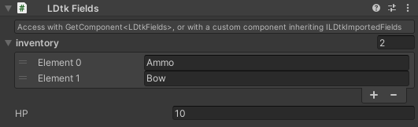

# Fields

[_**Scripting Reference**_](../../api/LDtkUnity.LDtkFields.yml)

Entity Instances can have fields in the LDtk editor. They can translate to Unity.  
  

Instantiated Entity/Level prefabs will gain a fields component if they are defined in LDtk.  
  

You can get any field's value on an entity/level with the field's matching identifier through code.

- **During Runtime:** Get a reference to the component.
  ```csharp
  int hp = GetComponent<LDtkFields>().GetInt("HP");
  ```    

- **During Import:** Use the [**ILDtkImportedFields**](../../api/LDtkUnity.ILDtkImportedFields.yml) interface on any custom scripts.  
  ```csharp
  public class Player : MonoBehaviour, ILDtkImportedFields
  {
        public Item[] items;
        public int health;

        public void OnLDtkImportFields(LDtkFields fields)
        {
            items = fields.GetEnumArray<Item>("inventory");
            health = fields.GetInt("HP");
        }
  }
  ```

## Nullables
Fields are nullable from within LDtk. They are also reflected in the fields component and can be checked if they are null in code.   
  
See: [LDtkFields.IsNull](../../api/LDtkUnity.LDtkFields.yml)


### Note

- The `MultiLines` type translates to create new lines correctly for Unity's text components.  
(ex. Text, TextMesh, etc)

- **`Int` or `Float` may not translate to the expected value if they were set to display as a radius in LDtk.**  
This is to match the physical relative radius of entities in the LDtk editor, in case the pixels per unit setting in the importer inspector are different then expected.

- **`Point` to `Vector2` will not translate to the expected vector values.**  
This is because the coordinate system in LDtk is based on a top-left origin point, and Unity's is bottom-left. When `Point` is converted over to Unity, it adjusts the Y vector value to maintain a correct position in world space. Because of this, the `Point` field is not a dependable Vector2 for conventional means and is only expected to store values for position use-cases.  
  
- Enum values are serialized as strings in the inspector.  
This is because enum scripts may or may not be generated.  
See the [**Enums Section**](../Importer/topic_Section_Enums.md) to learn about generating enum files during import.

- Entity References are internally their `iid` string. When getting the entity reference from code, it will get their GameObject of their specific `iid`. If the object was not found, then it will return null.  