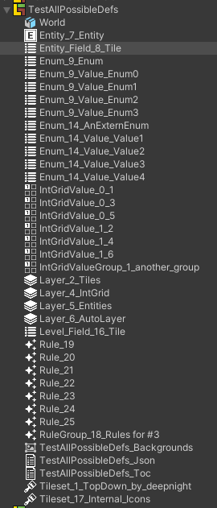

# Hierarchy, Definitions and Components
The imported project generates a hierarchy of GameObjects with accompanying scripts for the json hierarchy.
- Project Root
    - Worlds
        - Levels
            - Layers
                - Entity/Tilemap GameObjects

In addition, ScriptableObjects are generated for every definition in the project, and referenced by the appropriate components.  

Each Component/Definition contain data that (almost) match with the data structure in the json, and can be viewed [here.](https://ldtk.io/json/)

Some alterations were made from the original json data for better ease of use in Unity:
- Some data like color strings/ints or composite x/y values have been conveniently converted to their appropriate Unity values like `Color` or `Vector2` or `Vector2Int`
- Any usages of a definition uid are instead an object reference to it's appropriate definition object.
- Some component's fields are changed to reference other components instead, like the level's layers array.
- All components (except project root) have ease of access to their parent component though their `Parent` field.

## Components

### LDtkComponentProject
[_**Scripting Reference**_](../../api/LDtkUnity.LDtkComponentProject.yml)

### LDtkComponentWorld
[_**Scripting Reference**_](../../api/LDtkUnity.LDtkComponentWorld.yml)

### LDtkComponentLevel
[_**Scripting Reference**_](../../api/LDtkUnity.LDtkComponentLevel.yml)

### LDtkComponentLayer
[_**Scripting Reference**_](../../api/LDtkUnity.LDtkComponentLayer.yml)

### LDtkComponentEntity
[_**Scripting Reference**_](../../api/LDtkUnity.LDtkComponentEntity.yml)

### LDtkComponentLayerIntGridValues
[_**Scripting Reference**_](../../api/LDtkUnity.LDtkComponentLayerIntGridValues.yml)  
This component contains data to infer tilemap positions with IntGrid values.

### LDtkComponentLayerTilesetTiles
[_**Scripting Reference**_](../../api/LDtkUnity.LDtkComponentLayerTilesetTiles.yml)  
This component contains some helper functions to work with the potential of several tilemaps. 

### LDtkComponentLayerParallax
[_**Scripting Reference**_](../../api/LDtkUnity.LDtkComponentLayerParallax.yml)  
This component aims to match exactly what is presented in the LDtk editor if layer parallax options are utilized.

## Definition Objects

### LDtkDefinitionObjectLayer
[_**Scripting Reference**_](../../api/LDtkUnity.LDtkDefinitionObjectLayer.yml)

### LDtkDefinitionObjectEntity
[_**Scripting Reference**_](../../api/LDtkUnity.LDtkDefinitionObjectEntity.yml)

### LDtkDefinitionObjectTileset
[_**Scripting Reference**_](../../api/LDtkUnity.LDtkDefinitionObjectTileset.yml)

### LDtkDefinitionObjectField
[_**Scripting Reference**_](../../api/LDtkUnity.LDtkDefinitionObjectField.yml)

### LDtkDefinitionObjectEnum
[_**Scripting Reference**_](../../api/LDtkUnity.LDtkDefinitionObjectEnum.yml)

### LDtkDefinitionObjectAutoLayerRule
[_**Scripting Reference**_](../../api/LDtkUnity.LDtkDefinitionObjectAutoLayerRule.yml)

### LDtkDefinitionObjectAutoLayerRuleGroup
[_**Scripting Reference**_](../../api/LDtkUnity.LDtkDefinitionObjectAutoLayerRuleGroup.yml)