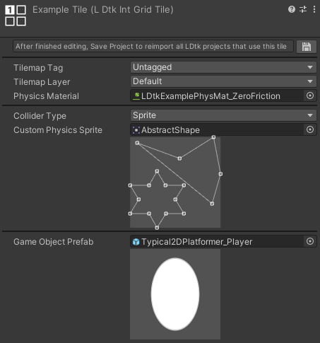
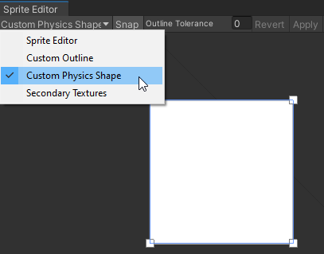

# IntGrid Tile
[_**Scripting Reference**_](../../api/LDtkUnity.LDtkIntGridTile.yml)  

In the importer's [**IntGrid section**](../Importer/topic_Section_IntGrids.md), you can assign Int Grid Tiles, which has options for tags, layers, custom collision, rendering colors, and GameObjects.

Make some at `Assets > Create > LDtkIntGridTile`

### Tilemap Tag/Layer
Sets the tag/layer of this tile's tilemap GameObject in the build process.  
For an IntGrid layer, if other tile assets have **either** a differing tag or layer, then they will be split into separate tilemaps.
This can allow for customized grouping of certain IntGrid values in Tilemaps.  
Optional; Use if customizing tags/layers is necessary. Otherwise, leave as `Untagged`/`Default`.

### Collider Type
- None: No collision. 
  - Renders a square if rendering IntGridValues is enabled.
- Sprite: Use a sprite's physics shape(s) for collision.   
  - Renders the sprite if rendering IntGridValues is enabled.
- Grid: Square collision. 
  - Renders a square if rendering IntGridValues is enabled.

### Custom Physics Sprite
The collision shape is based on the physics shape(s) of the sprite which is previewed here for convenience.  
Commonly useful for slopes, etc.

### Game Object Prefab 
Spawns a prefab at this tile.  
Optional; Use this when a GameObject is more fit for a situation.

## Sprite Collider
When the collider type is set to Sprite, you can use a sprite's physics shape(s) for collision.  
To make a custom physics shape on a sprite, go to the **Physics Shape** section of a sprite editor window.  
