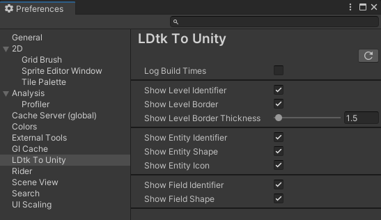
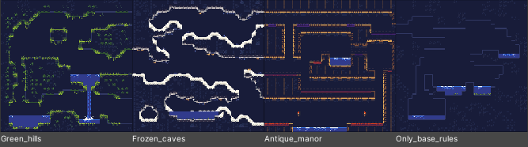
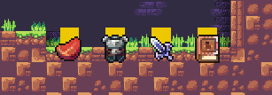
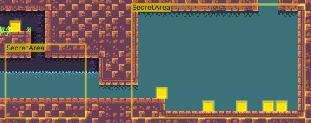

# Preferences

There are some editor-only preference options.  
Find the preferences at `Editor > Preferences > LDtk To Unity`  
   

### Write Profiled Imports
When enabled, Unity will write a .raw file to a "Profiler" folder in this root unity project upon importing any LDtk level or project.  
These files can be opened from the profiler window to view the performance of an import.  
  
Only toggle on for analysis purposes; this has a performance overhead for every import and the files can also use a lot of storage, especially if deep profiling is enabled.  

### Level Identifier
Display the level identifiers at the bottom left of a level in the scene view, colored by their `bgColor` from LDtk.  
Clicking the text selects the level object.  
  

### Level Border
Toggle on to show the border of the levels in the scene, colored by their `bgColor` from LDtk.  
When toggled on, there is a slider to customize the border width.  
The line thickness is adjustable.  
  

### Entity Identifier
Display the entity identifiers at the the entity objects that enable this visibility in LDtk, colored by their definition color (or first field's color) from LDtk.    
Clicking the text selects the entity object.  
   

### Entity Icon
Display the entity icons for the entities that enable this visibility in LDtk.  
Clicking the image selects the entity GameObject.  

### Entity Shape
Display entity shapes in the scene view (Rectangle, Ellipse, Cross).  
The line thickness is adjustable.  
There is also an option to only show hollow shapes.  
There is also an option to only show the shape's border.  

### Entity Field References
Display entity reference fields in the scene view.  
The line thickness is adjustable.  

### Entity Field Radius
Display entity float/int fields (that were set to display a radius) in the scene view.  
The line thickness is adjustable.  

### Entity Field Points
Display entity point fields in the scene view.  
The line thickness is adjustable.  
