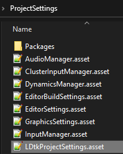

# Project Settings

There are some project settings related to this importer.  
Find the preferences at `Editor > Project Settings > LDtk To Unity`  

  

### Internal Icons Texture
LDtk has an image embedded in LDtk that you can use for icons or as a tileset.
If you are using it in your project and would like the importer to load it, it will need to be provided by assigning here in the Project Settings, as it cannot be redistributed by this importer.
You can obtain [this icon pack](https://finalbossblues.itch.io/icons) and assign the image found in `icons_8.13.20/fullcolor/icons_full_16.png` of the downloaded zip file.

### Reimport all LDtk assets
Reimports all LDtk projects and levels. Useful as a shortcut to reimport everything at once.

### Note
- There's also a button to travel to the preferences section more easily.
- The project settings is different from the [preferences](topic_Preferences.md) in that these are saved to your project (and into source control), whereas the preferences are saved to your local computer only.
- The settings configured in here will write into a file located in your Unity project's `ProjectSettings` folder.  
  