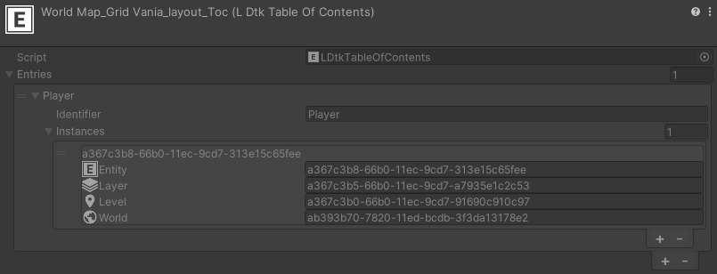
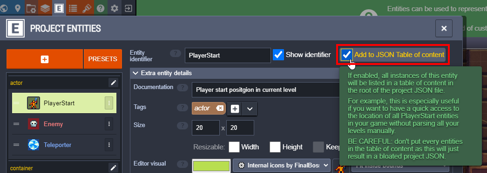

# Table Of Contents
[_**Scripting Reference**_](../../api/LDtkUnity.LDtkTableOfContents.yml)

This is an import artifact of the [**Project Importer**](../Importer/topic_ProjectImporter.md).  
Use it for easily getting a certain entity type in a level.

The table of contents is generated when any entity definitions have their `exportToToc` toggle enabled.

