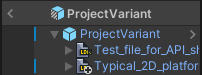
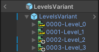

# Troubleshooting
Over the project's development, there have been some common reports/questions about issues with the importer to provide an explanation.  
If any issues are found, [**post an issue on GitHub**](https://github.com/Cammin/LDtkUnity/issues) or report it in the **[Discord server](https://discord.gg/7RPGAW9dJx)**.

## Reimport Project
If there are any problems in the import process, try reimporting, which can often fix the issue.  
But if there are still problems or if consistent manual reimporting is required to function properly, then report the issue.  
  
For separate level files, the imported level files depend on the project file to be imported properly firstly.  
Consider reimporting the project file before the levels if there are also import issues with the level.

## Loading Relative Assets
An issue that can happen is that tileset textures or separate levels fail to load. But to explain this, first understand how LDtk manages files:  
*LDtk projects reference external assets like textures and separate levels from a relative path (ex.`"Art/Tileset.png"`).  
LDtk separate levels also reference their source project (ex.`"../GameProject.ldtk"`).  
This means that if any assets are moved, then the path reference is lost in LDtk unless both are moved to maintain a proper relative path.*

This is the same case for the Unity importer. The importer also uses the same relative paths to load assets.  
A rule of thumb to consider is that **as long as LDtk can load the asset, then so can the importer**.  
Also, it is important for Unity to have all assets contained in the Unity project in order to be loadable. If they are not, then the importer will encounter a loading error.  

## Nested Prefabs
*This issue may be fixed in the future, but important to follow for now.*  
Due to technical limitations related to the order of when prefabs are imported, it is **not** recommended for LDtk projects/levels to be nested inside prefab and prefab variants, and can cause unexpected problems if this is tried:  

  

## Failed Import (white file)
Ensure that your LDtk project is saved in the newest version of LDtk to potentially fix the problem.  
This is never expected to happen even if an import issue is inevitable. 
If a LDtk project/level file fails to import, then this is an objective problem with the importer that the developer should always fix.  
Report the issue to help fix the problem.

## Custom Prefab Identifier Uniqueness
When using custom prefabs for levels or entities, it is discouraged to use two of the same component type in any given prefab GameObject. (ex. Two CircleCollider2Ds in the same GameObject)  
This is because an imported hierarchy needs to maintain identities for each component to remember any possible prefab overrides between reimports. Using multiple of the same component confuses Unity on which component is being tracked for prefab overrides.    
Unity will log a warning when this happens.

## Tilemap Seams
The solution is by using a sprite atlas to add padding between sprite slices.  
See **[Tilemap Tearing](../Topics/topic_TilemapTearing.md)** and **[Main/SpriteAtlas](../Importer/topic_Section_Main.md)**

## Composite Collider
Sometimes it's possible that the composite colliders retain changes between the previous import which can negatively impact the expected collision of levels.
To fix this, select the root LDtk project in the scene, and then revert the prefab overrides, which should revert any unexpected changes applied to the composite collider components.  
A fix was investigated, but not found yet. This may still be fixed in the future.

