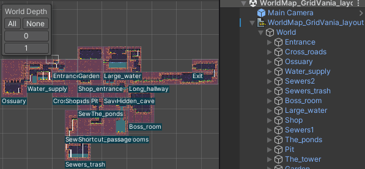

# World Depth

If a LDtk project's levels have different world depths, then a UI tool will be available in the scene view.

Selecting a certain depth will isolate the visibility and pick-ability of levels to the depth chosen.
Selecting `None` will hide all, and `All` will reveal all of them. 

   

