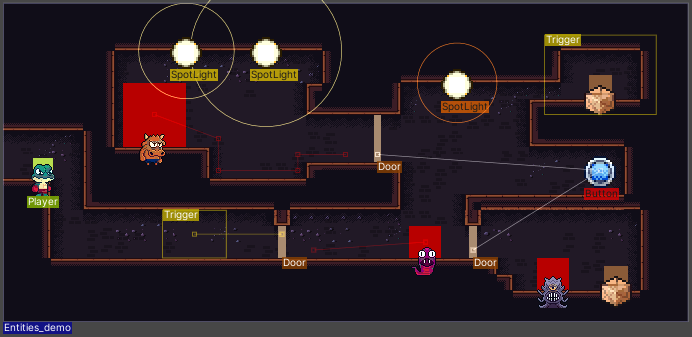

  

A Unity importer system for [deepnight](https://deepnight.net/)'s [Level Designer Toolkit](https://ldtk.io/).

  
  
  
  
  
  
  

**It's a simple drag and drop!**  

## Features  
- Uses [ScriptedImporters](https://docs.unity3d.com/Manual/ScriptedImporters.html) to import an LDtk project
  - Automatically re-imports whenever the LDtk project is saved
- TileLayers, AutoLayers, and level backgrounds work out of the box
  - Can pack into a [SpriteAtlas](https://docs.unity3d.com/Manual/class-SpriteAtlas.html)
- IntGridValue assets used for collision
  - Optionally GameObjects too
- Entities from prefabs
- Entities and levels have all field data available
- Automatic enum script generation
- Many properties and functions that extend onto LDtk data for better context in Unity ([API here](https://cammin.github.io/LDtkToUnity/api/LDtkUnity.html))
- Works with/without separate level files
- Supports Unity's [Configurable Enter Play Mode](https://docs.unity3d.com/Manual/ConfigurableEnterPlayMode.html)  
- [Fully documented](https://cammin.github.io/LDtkToUnity/)

**Entities have special scene drawers!**  
  

If you have any questions/problems then post an issue; I'd gladly take any feedback.  
Alternatively, contact me at cameo221@gmail.com, on Discord at Cammin#1689, or Twitter [@CKrebbers](https://twitter.com/CKrebbers).  

If you like this importer, consider signing a [survey](https://forms.gle/a7iRkuBFxpgZpwRd8) for feedback.  
If you make a game using this, then I'd be happy to check it out! Contact me or give me a shout-out on [Twitter](https://twitter.com/CKrebbers).

### Disclaimer
This project has stabilized development! :tada:  
There may still be some new features, but development is calming down.  
The changelog documents any breaking changes, but feel free to post issues regarding any problems.

###### Premise & Review
This importer started as an attempt to produce levels in an easy and streamlined fashion.
When searching for a solution to mass-produce levels, I discovered LDtk, as its really fun to use and is relatively young. 
I started working on a personal level importer, but after noticing how convenient and standalone the importer has become, I took it upon myself to make this a public repo as a package!
I enjoyed it's production, and learnt a lot in the process.

  
